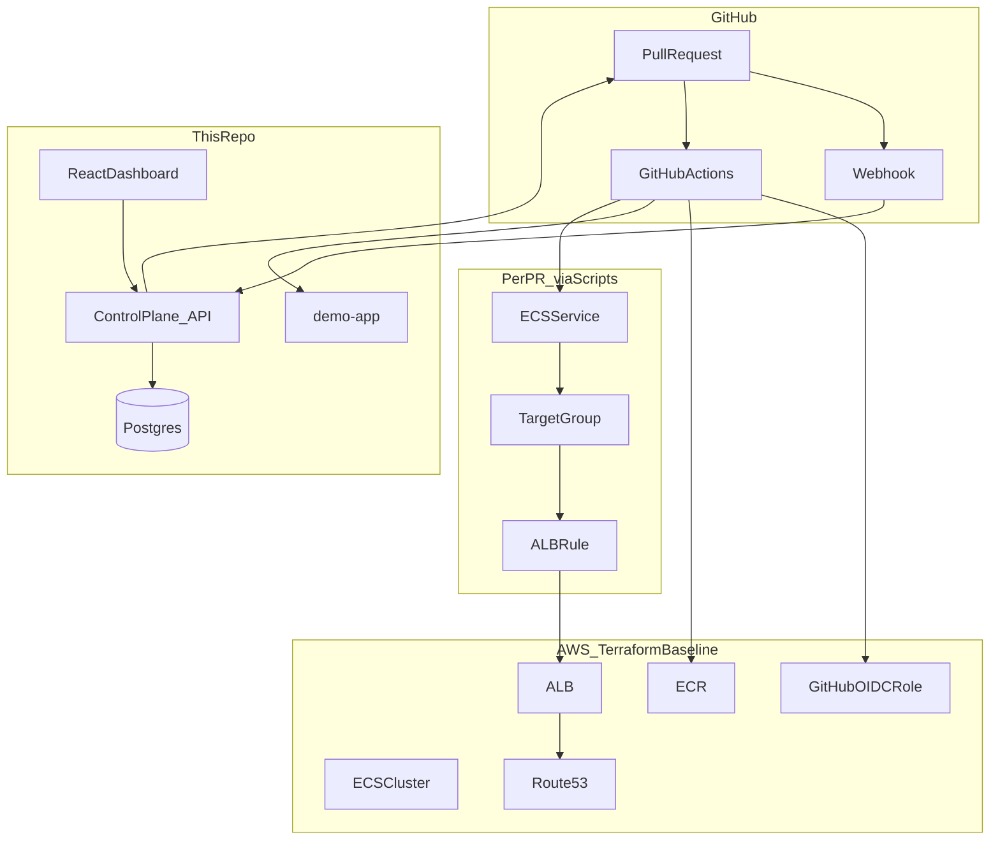

# Deploy Preview Service

A portfolio-grade **deploy preview platform** that spins up ephemeral environments on every pull request — built with Node.js, Docker, GitHub Actions, Terraform, and AWS ECS Fargate.

On every PR, a verified GitHub webhook hits the control plane, GitHub Actions builds a container, pushes to ECR, provisions a Fargate service behind an ALB with a per-PR hostname, and tears it all down when the PR closes. Baseline infra is Terraform; per-PR resources are automation scripts with OIDC auth.

**Preview URL format:** `https://pr-{number}.preview.yourdomain.com`

---

## Architecture



### Shared vs ephemeral resources

| Managed by Terraform | Managed by GitHub Actions scripts |
|----------------------|-----------------------------------|
| ECR repository | ECS task definitions |
| ECS cluster | ECS services (`dp-pr-{n}-svc`) |
| ALB + HTTPS listener | Target groups |
| Route53 wildcard DNS | ALB listener rules |
| ACM TLS certificate | Container image tags |
| GitHub OIDC IAM role | |

---

## How it works

1. **PR opened or updated** — GitHub sends a `pull_request` webhook to the control plane, which records a `pending` deployment and posts a comment on the PR.
2. **GitHub Actions** — `preview-deploy.yml` assumes an AWS role via OIDC, builds `demo-app`, pushes to ECR, and PATCHes the control plane to `building`.
3. **Deploy script** — `scripts/deploy-preview.sh` registers a Fargate task, creates an ALB target group + listener rule for `pr-{n}.preview.domain.com`, and starts an ECS service.
4. **Live** — Once the service is stable, the workflow PATCHes `live` with the preview URL. The control plane updates the PR comment.
5. **Dashboard** — The React UI polls `/api/deployments` every 10s to show status, links, and a timeline.
6. **PR closed** — `preview-cleanup.yml` deletes the ECS service, ALB rule, target group, and ECR tag, then marks the deployment `destroyed`.

---

## Repository layout

```
CICD/
├── apps/
│   ├── demo-app/          # Sample app deployed as previews
│   ├── control-plane/     # Webhook receiver + deployment API
│   └── dashboard/         # React status UI
├── infra/terraform/       # AWS baseline (ECR, ECS, ALB, DNS, IAM)
├── scripts/               # deploy-preview.sh, cleanup-preview.sh
├── .github/workflows/     # preview-deploy, preview-cleanup, terraform-plan
└── docker-compose.yml     # Local dev stack
```

---

## Prerequisites

| Requirement | Notes |
|-------------|-------|
| Node.js 20+ | For local development |
| Docker | For local stack and image builds |
| AWS account | ECS, ECR, ALB, Route53, IAM, ACM |
| Domain + Route53 hosted zone | e.g. `preview.example.com` |
| Terraform 1.5+ | For infra provisioning |
| GitHub repo with Actions | For CI/CD workflows |

---

## Quick start (local only)

No AWS required — runs the full app stack locally.

```bash
git clone <repo-url>
cd CICD
cp .env.example .env
npm install
npm run dev          # docker compose up --build
```

| Service | URL |
|---------|-----|
| Demo app | http://localhost:3000 |
| Control plane | http://localhost:3001 |
| Dashboard | http://localhost:5173 |
| Postgres | localhost:5432 |

Run individual apps without Docker:

```bash
docker compose up -d postgres
npm run dev --workspace=@deploy-preview/control-plane
npm run dev --workspace=@deploy-preview/demo-app
npm run dev --workspace=@deploy-preview/dashboard
```

### Test webhooks locally

GitHub webhooks need a public URL. Use [smee.io](https://smee.io) or [ngrok](https://ngrok.com):

```bash
# smee.io — forward to local control plane
npx smee-client -u https://smee.io/<your-channel> -t http://localhost:3001/webhooks/github
```

Register the smee.io URL as your GitHub webhook endpoint. Set the secret to match `GITHUB_WEBHOOK_SECRET` in `.env`.

Simulate a webhook manually:

```bash
BODY='{"action":"opened","pull_request":{"number":42,"head":{"ref":"feature/foo","sha":"abc123def456"}},"repository":{"full_name":"you/CICD"}}'
SIG="sha256=$(printf '%s' "$BODY" | openssl dgst -sha256 -hmac dev-secret | awk '{print $2}')"

curl -X POST http://localhost:3001/webhooks/github \
  -H "Content-Type: application/json" \
  -H "X-GitHub-Event: pull_request" \
  -H "X-Hub-Signature-256: $SIG" \
  -d "$BODY"
```

Check the dashboard at http://localhost:5173 — you should see PR #42 with status `pending`.

---

## Production setup

### 1. Provision AWS infrastructure

```bash
cd infra/terraform
cp terraform.tfvars.example terraform.tfvars
# Edit: domain_name, route53_zone_id, github_repository

terraform init
terraform plan
terraform apply
```

See [infra/terraform/README.md](infra/terraform/README.md) for details.

Copy Terraform outputs into GitHub repository **variables**:

```bash
terraform output -json github_actions_variables
```

### 2. Deploy the control plane

The control plane must be publicly reachable for GitHub webhooks and Actions callbacks. Options:

- Deploy to ECS/Fargate, Railway, Fly.io, or any container host
- Set env vars from `.env.example` (`DATABASE_URL`, `GITHUB_WEBHOOK_SECRET`, `GITHUB_TOKEN`, `CONTROL_PLANE_TOKEN`, etc.)

### 3. Configure GitHub

**Repository variables** — from Terraform outputs (see [scripts/README.md](scripts/README.md))

**Repository secrets:**

| Secret | Value |
|--------|-------|
| `CONTROL_PLANE_URL` | Public control plane URL |
| `CONTROL_PLANE_TOKEN` | Matches control plane `CONTROL_PLANE_TOKEN` |

**Webhook** — Settings → Webhooks:

- URL: `{CONTROL_PLANE_URL}/webhooks/github`
- Content type: `application/json`
- Secret: matches `GITHUB_WEBHOOK_SECRET`
- Events: Pull requests

---

## End-to-end demo walkthrough

Once AWS, Terraform, GitHub variables/secrets, and the control plane are configured:

1. **Open a PR** against the repo (e.g. change a line in `apps/demo-app`).
2. **Watch GitHub Actions** — `Preview Deploy` workflow builds and deploys.
3. **Check the PR comment** — control plane posts a preview URL when status is `live`.
4. **Open the preview** — `https://pr-{n}.preview.yourdomain.com` shows PR metadata (number, branch, commit SHA, build time).
5. **Open the dashboard** — deployment shows `live` with links to the PR, preview, and CloudWatch logs.
6. **Push a new commit** — concurrency cancels the stale deploy; preview updates to the new SHA.
7. **Close the PR** — `Preview Cleanup` workflow tears down ECS, ALB rule, and target group; dashboard shows `destroyed`.

---

## Workflows

| Workflow | Trigger | What it does |
|----------|---------|--------------|
| [preview-deploy.yml](.github/workflows/preview-deploy.yml) | PR opened / updated | Build → ECR → ECS + ALB rule |
| [preview-cleanup.yml](.github/workflows/preview-cleanup.yml) | PR closed | Destroy per-PR AWS resources |
| [terraform-plan.yml](.github/workflows/terraform-plan.yml) | PR touching `infra/terraform/` | `terraform fmt -check` + `validate` |

---

## Troubleshooting

### ALB health checks failing (502 / unhealthy targets)

- Confirm the demo app exposes `GET /health` returning 200.
- Check the ECS security group allows traffic from the ALB security group on port 3000.
- Fargate tasks need `assignPublicIp=ENABLED` in public subnets (no NAT gateway in this setup).
- Allow 60s grace period after deploy — health checks need time on cold start.

```bash
aws ecs describe-services --cluster <cluster> --services dp-pr-<n>-svc
aws elbv2 describe-target-health --target-group-arn <tg-arn>
```

### DNS not resolving

- ACM certificate validation must complete before HTTPS works (`terraform apply` waits for this).
- Route53 wildcard record `*.preview.yourdomain.com` must alias to the ALB.
- DNS propagation can take a few minutes after first apply.

### OIDC / GitHub Actions auth failures

- Verify `AWS_ROLE_ARN` matches `terraform output aws_role_arn`.
- Confirm `github_repository` in Terraform matches the repo (`owner/name`).
- Trust policy uses `repo:owner/name:*` — forks from outside repos won't authenticate (intentional).
- Check the workflow has `permissions: id-token: write`.

### Control plane not updating

- Webhook secret must match on GitHub and control plane.
- `CONTROL_PLANE_URL` and `CONTROL_PLANE_TOKEN` secrets must be set in GitHub.
- If the deployment record isn't found, the webhook may not have fired — check webhook delivery logs in GitHub Settings.

### Preview deploy workflow skipped

- Workflows skip PRs from forks (`head.repo.full_name == github.repository`).
- Ensure all repository **variables** from Terraform are configured.

---

## Cost expectations

| Resource | Approximate cost |
|----------|------------------|
| ALB | ~$15–30/month while running |
| Fargate tasks | ~$0.01–0.05/hour per active preview |
| ECR storage | Minimal (lifecycle policy keeps 30 images) |
| Route53 | ~$0.50/month per hosted zone |
| NAT gateway | **Not used** — tasks run in public subnets to reduce cost |

**Teardown when not demoing:**

```bash
cd infra/terraform
terraform destroy
```

Also delete any orphaned per-PR resources if cleanup workflows failed.

---

## Development commands

```bash
npm install              # Install all workspaces
npm run build            # Build all apps
npm run lint             # ESLint
npm run format           # Prettier
npm run dev              # docker compose up --build
```

---

## What this demonstrates

- **Webhook-driven automation** with HMAC signature verification
- **Containerization** with multi-stage Docker builds
- **Infra-as-code** — Terraform for baseline AWS resources
- **OIDC federation** — no long-lived AWS keys in GitHub
- **Ephemeral environments** with deterministic cleanup
- **Full-stack ownership** — backend orchestration, CI pipelines, and React dashboard

This is the layer most web developers never touch — and exactly what platform/SRE interviewers look for.
